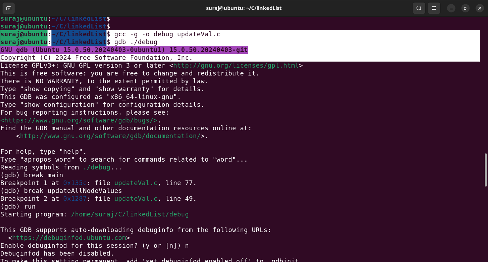

# Linked List Program with Debugging Example
This is a simple C program that demonstrates the use of a linked list.The program includes intentional bugs to showcase 
how to debug issues like segmentation faults and invalid memory access using open source GDB tool.

# About Program
### The program performs the following tasks:
### Creates a linked list with initial values.
### Inserts a new node at the end of the list.
### Updates all node values based on user input.
### Prints the linked list.
The program includes intentional bugs in the updateAllNodeValues function to demonstrate how to use GDB tool to debugg the program.

## How to Compile and Run using GDB
## 1. Compile the Program
Compile the program with debugging symbols using gcc:
``` gcc -g -o debug updateVal.c ```
## 2. Run the Program
Execute the compiled program:
```
gdb ./debug
`````


## 3. Set Breakpoints
Set breakpoints at key functions:
```
break main
break updateAllNodeValues
```


## 4. Run the Program
Start the program in GDB:
```
run
```


## 5. Step Through the Code(Use to enter a particular function)
And continue to pass the the function and move forward to next breakPoint i.e updateAllNode.
```
next
continue
```


Use next to step through the code line by line:


## 5. Identify the Segmentation Fault


When the program crashes, use backtrace to identify the issue: 
## backtrace cmd help to us to show the memory address and line number where error occurred.
```
backtrace
```

## 6. Fix the Bug
The bug is in the updateAllNodeValues function, where temp->data is accessed after temp becomes NULL. Fix the function as follows:
## intial program where we accessed invalid memory address temp->data after temp while loop causing segementation fault.
```
//function to update all values of given node
void updateAllNodeValues(Node* head,int updateBy){

        //Using temp Node.
        Node* temp = head;

        while(temp != NULL){
                printf("%d->",temp->data+updateBy);
                temp = temp->next;
        }

        printf("NULL\n");

        //lets try to print the next temp data.Since the temp is terminated , access temp->data will lead to invalid memory access.
        printf("Showing Invalid memory access:Since temp is terminated access the temp data futher causes invalid memory issue %d",temp->data);

}

```

## Fixing the issue.
```
Node* updateAllNodeValues(Node* head, int updateBy) {
    Node* temp = head;

    while (temp != NULL) {
        printf("%d->", temp->data + updateBy);
        temp = temp->next;
    }

    printf("NULL\n");
    return head;
}

```

## 7. Recompile and Test
Recompile the program and test the fix:
```
gcc -g -o debug updateVal.c
./debug
